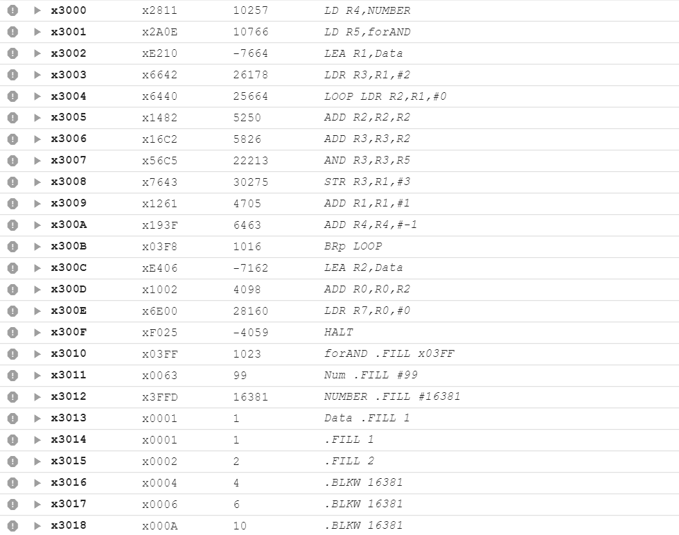
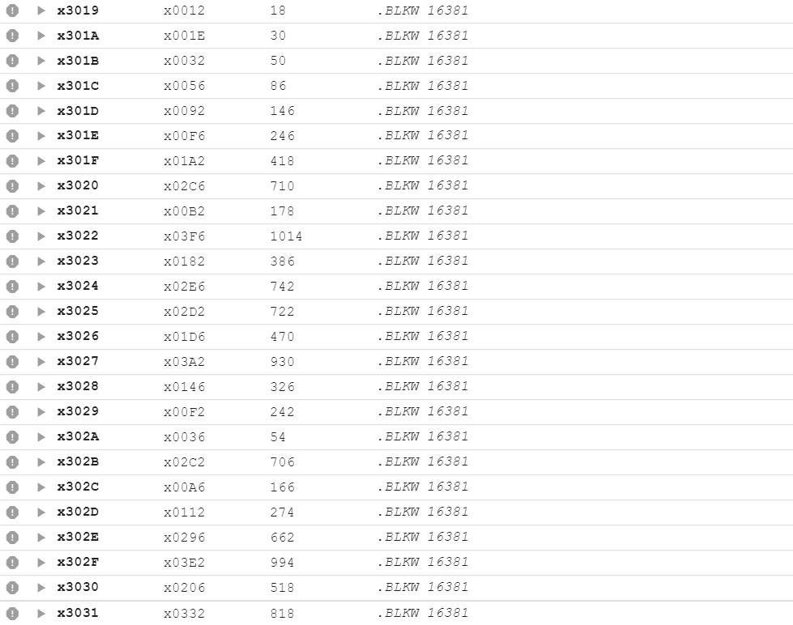

# Lab2实验：Lending Your Name
姓名：杨涛
学号：PB20020599
## L版本程序设计
循环函数为F(n) = (F(n-1) + 2 * F(n-3)) mod 1024 (1 <= n <= 16384)
其中mod 1024$\equiv$mod $2^{10}$即为取寄存器16位的低10位作为数值
而溢出同样意味着取模，且不会对低位的正确性造成影响，则只需要对寄存器加法进行考虑即可。
计算结束后只需要将结果与x03FF取AND即可得到最终答案。
### 原始版本
算法直接选择打表，并将打表结果储存在开辟的空间中。
```
.ORIG x3000 ; start the program at location x3000

LD R4,NUMBER
LD R5,forAND
LEA R1,Data;R1存正在运算的n-3的地址
LDR R3,R1,#2
LOOP LDR R2,R1,#0
ADD R2,R2,R2
ADD R3,R3,R2
AND R3,R3,R5
STR R3,R1,#3
ADD R1,R1,#1
ADD R4,R4,#-1
BRp LOOP
LEA R2,Data;Data的地址
ADD R0,R0,R2;F(n)的地址
LDR R7,R0,#0
HALT
forAND .FILL x03FF
Num .FILL #99
NUMBER .FILL #16381
Data .FILL 1
.FILL 1
.FILL 2
.BLKW 16381    ;总计x4000
.FILL x03A2;F(20)
.FILL x0002;F(02)
.FILL x000A;F(05)
.FILL x0356;F(99)

.END
```
#### 部分实验结果
从x3013起从F(0)开始存储实验结果，即在本例中，F(n)=mem[n+x3013]



### 改进版本1&2
#### 改进版本1
充分利用寄存器，存储三个数据并计算下一位数据，计算完毕后进行位置移动。
R7=F(n),R1=F(n+1),R2=F(n+2)
计算F(n+3)=R3=R2+2*R7,之后进行移位
R7←R1,R1←R2,R2←R3
由此可实现了R7从F(n)到F(n+1)的变化
根据n=n-1是否为小于则可以判断是否输出。此算法可输出n=0的情况。

```
.ORIG x3000
ADD R1,R1,#1
ADD R2,R2,#1
ADD R3,R3,#2
LOOP ADD R7,R1,#0       ;移位开始
ADD R1,R2,#0
ADD R2,R3,#0            ;移位结束
ADD R3,R7,R7
ADD R3,R2,R3            ;计算R3
ADD R0,R0,#-1
BRzp LOOP
LD R6,forAND
AND R7,R7,R6
HALT
forAND .FILL x03FF
Fa .FILL x03A2
Fb .FILL x0002
Fc .FILL x000A
Fd .FILL x0356
.END
```
#### 改进版本2
在改进版本1的基础上作两个调整
* 去掉HALT并调整指令顺序：因为后面四个数据所对应的指令不是BR就是BRp，让中间循环块结束后的ConditionCode来进行验证则必然是NOP，最后结果一定是未运行，则可滑到.END结束程序。
* 将R7\*2一步存储到R1中，减少了先移位存储后乘二的步骤，因此改变存储顺序为R1←R7←R2←R3，其中R1=2\*R7。
```
.ORIG x3000         ;2*R7=R1←R7←R2←R3
ADD R7,R7,#1
ADD R2,R2,#1
ADD R3,R3,#2
LD R6,forAND
LOOP ADD R1,R7,R7
ADD R7,R2,#0
AND R7,R7,R6
ADD R2,R3,#0
ADD R3,R1,R2
ADD R0,R0,#-1
BRp LOOP
forAND .FILL x03FF
Fa .FILL x03A2
Fb .FILL x0002
Fc .FILL x000A
Fd .FILL x0356
.END
```
### 正确性检验
初始版和改进版采用两种不同的算法，则直接对比两者的结果输出，可知其基本正确。
|输入n|初始版结果|改进版结果|
|-|-|-|
|20|930|930|
|2|2|2|
|5|10|10|
|99|854|854|
### 行数计算
改进前的版本为27行，改进后减少至两个版本分别为18行和16行。