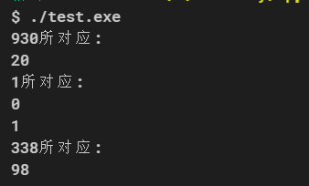

# Lab3实验：Better Angels
姓名：杨涛
学号：PB20020599
## 阅读程序
用注释表明阅读程序得出的结论：
```
.ORIG x3000
;初始化
ADD R1,R1,x1
ADD R2,R2,X1
ADD R3,R3,x2
LD R6,CON
ADD R4,R1,R1
ADD R1,R2,#0
ADD R2,R3,#0
ADD R3,R4,R3
;计算数列下一位
BRnzp #1
ADD R3,R5,#0
ADD R5,R3,R6
BRzp #-3
;取模
ADD R0,R0,#-1
BRp #-10
;循环条件
ADD R7,R1,#0 
HALT
CON .FILL #-1024
a .FILL #930
b .FILL #1
c .FILL #1
d .FILL #338
.END
```
## guess
由a，b，c，d对应的数字，编写cpp程序输出100以内的对应自变量。
```c++
#include <iostream>
#include <vector>
#include <algorithm>
using namespace std;
void output(vector<int> &s, int i, int max)
{
    auto p = find(s.begin(), s.begin() + max, i);
    cout << i << "所对应:" << endl;
    while (p != s.begin() + max)
    {
        cout << p - s.begin() << endl;
        p = find(p+1, s.begin() + max, i);
    }
}
int main()
{
    vector<int> s;
    s.push_back(1);
    s.push_back(1);
    s.push_back(2);
    int i;
    for (i = 3; i <= 100; i++)
    {
        s.push_back((s[i - 1] + 2 * s[i - 3]) % 1024);
    }
    output(s, 930,100);
    output(s, 1,100);
    output(s, 338,100);
    return 0;
}
```
实验结果：

共有四种可能，查询班级群后发现有两个人的学号符合，
一个是PB20000098，另一个是PB20000198，
经过直接小窗询问后确定是PB20000098。

## Optimizeing

因为表达式取模，故一定存在循环节，不过循环节的起点和长度未知，所以编写cpp程序寻找循环节的位置。
```C++
//test.cpp
#include <iostream>
#include <cstdio>
#include <vector>
#include <algorithm>
using namespace std;
int main()
{
    vector<int> s;
    bool flag = false;
    s.push_back(1);
    s.push_back(1);
    s.push_back(2);
    int i;
    auto p = s.begin();
    for (i = 3; (!flag) && i <= 16384; i++)
    {
        s.push_back((s[i - 1] + 2 * s[i - 3]) % 1024);
        p = s.begin()+1;
        auto end = s.end() - 1;
        while ((p = find(p+1, end, *end)) != end)
            if (p - s.begin() >= 2)
                if ((*(p - 1) == *(end - 1)) && (*(p - 2) == *(end - 2)))
                {
                    flag = true;
                    break;
                }
    }
    auto begin = s.begin(), end = s.end() - 1;
    if (flag)
        printf("%d:%d\n%d:%d\n%d:%d\n%d:%d\n%d:%d\n%d:%d\n",
               p - begin - 2, *(p - 2),
               p - begin - 1, *(p - 1),
               p - begin, *p,
               end - begin - 2, *(end - 2),
               end - begin - 1, *(end - 1),
               end - begin, *(end));
    else
        printf("Haven't Found.");
    return 0;
}
```
运行上面的程序，得到：
```c++
$ ./test.exe
20:930
21:326
22:242
148:930
149:326
150:242
```
可知循环节长度为128，从第20开始循环。因为长度和起始位置都比较适合，故可以使用循环的方式求数列。

下面首先打表得到所需数据点。

```C++
#include <iostream>
#include <fstream>
#include <vector>
using namespace std;
int main()
{
    fstream f;
    f.open("file.txt",ios::out | ios::trunc);
    vector<int> s;
    s.push_back(1);
    s.push_back(1);
    s.push_back(2);
    int i;
    for (i = 3; i <= 147; i++)
    {
        s.push_back((s[i - 1] + 2 * s[i - 3]) % 1024);
    }
    for (i = 0; i <= 147; i++)
    f<<".FILL x"<<hex<<s[i]<<endl;
    return 0;
}
```
首先判断输入R0是否大于等于20，若是则减去20并mod1024，读取对应数据，否则直接读取数据。
```
.ORIG x3000
ADD R1,R0,#-10
ADD R1,R1,#-10          ;R1=R0-20
BRzp Switch
LEA R5,DATA1
ADD R5,R5,R0
LDR R7,R5,#0
HALT
Switch LEA R5,DATA2
LD R0,ForAND
AND R1,R1,R0            ;R1%128，其中128为循环周期
ADD R5,R5,R1
LDR R7,R5,#0
HALT
ForAND .FILL x7F
DATA1 .FILL x1          ;F(0)
                        ;F(1)~F(19)数据块略
DATA2 .FILL x3a2        ;F(20)
                        ;F(21)~F(147)数据块略
.END
```

分析代码后可知，若R0<20，则运行指令数为6，否则为8.

## Optimizeing2
然而第一版因为判断，需要更多的运行指令。由第一版打表的思想，直接尝试全打表，
```
.ORIG x3000
LEA R5,DATA
ADD R5,R5,R0
LDR R7,R5,#0
HALT
DATA .FILL x1       ;F(0)
                    ;数据块F(1)~F(16384)，略
```
则可将时间压缩至三条指令。